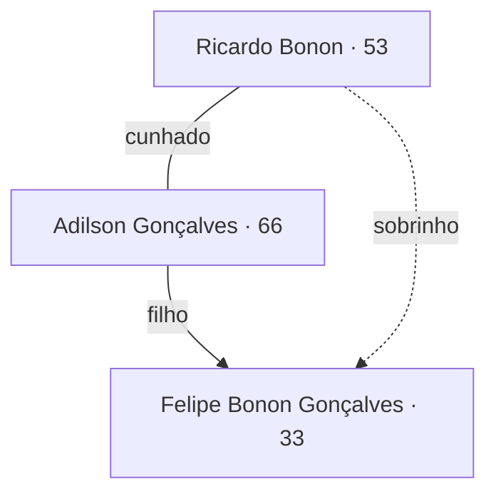
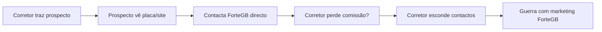
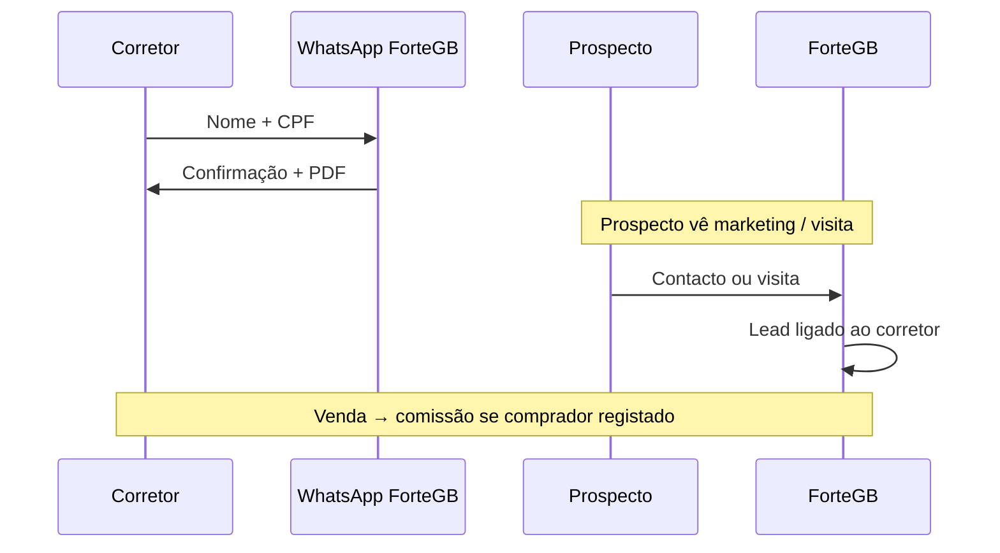
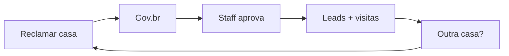

# ForteGB — Apresentação aos Sócios

> **Para:** Adilson e Felipe · **Por:** Ricardo · **Data:** julho/2026  
> **Objetivo:** validar modelo de negócio, decisões e plataforma digital — **não** detalhe técnico.  
> **Versão gráfica:** abrir [`apresentacao-socios.html`](./apresentacao-socios.html) no browser (ou imprimir como PDF).

> **Manutenção:** este documento é um **snapshot para apresentação** — foco forte em **corretores** (jul/2026).  
> **Fonte da verdade:** [`company-structure.md`](./company-structure.md). Pedir **refresh** a Ricardo/AI quando decisões mudarem — não actualizar à mão em paralelo ao canon.

**Documento completo (referência):** [`company-structure.md`](./company-structure.md)

---

## 1. Resumo executivo

A ForteGB constrói e vende casas em Campinas. Queremos **vender mais** com **menos fricção** — site, visitas autoguiadas, marketing aberto — **sem** brigar com corretores.

**Ideia central:**

> **Preço único** para todos · Corretor **regista o prospecto antes** · ForteGB pode divulgar à vontade · **Comissão garantida** se o comprador era registado.

**Valores:** transparência, confiança, proximidade — sem jogos (inclui aviso aos corretores na venda com dados do comprador).

---

## 2. Quem somos e como decidimos

### Sócios

| Sócio | Foco principal |
|-------|----------------|
| **Ricardo** | Vendas, digital, plataforma, engenharia/obra |
| **Adilson** | Compras, obra, decisões do dia-a-dia |
| **Felipe** | Investidor; pode apoiar tech; **admin** na plataforma |

**Família envolvida (não sócios):** Cláudia (Adilson) e Gisele (Ricardo) — documentação/terrenos; Gisele apoia vendas na plataforma.

### Regras de decisão

| Situação | Quem decide |
|----------|-------------|
| **Acima de R$ 100.000** | **Os três** (unanimidade) |
| **Terreno, preço, fecho de venda** | **Os três** |
| **Dia-a-dia abaixo de R$ 100k** | Ricardo + Adilson |
| **Plataforma — construção** | Ricardo (autofinanciado, gasto mínimo) |
| **Plataforma — prontidão e custos recorrentes** | Ricardo apresenta → **os três** quando valor provado |

---

## 3. Operação hoje (obra e negócio)

| Área | Quem | Nota |
|------|------|------|
| Obra | Mestre de obras + R. & A. | Visitas semanais; apoio diário |
| Compras | **Adilson** | Principal |
| Vendas | **Ricardo** | Adilson liderou Casas 01–02; transição feita |
| Finanças | Os três | PIX; quem paga regista (planilha hoje) |
| Legal | PF | **ForteGB = marca**; sem CNPJ/LTDA por agora |

**Casas concluídas:** 01 R-35 · 02 P-31 · 03 Q-21 (em curso/venda conforme estado actual).

---

## 4. O problema com corretores (passado)

- Vendas passadas: **via corretores**, acordos **informais**.
- Comissão típica região ~**5%**; negociámos **3%** nas duas vendas.
- Pagamento em **duas etapas:** sinal + escritura.

---

## 5. Modelo novo com corretores (proposta validada)

### Cinco pilares

1. **Preço unificado** — mesmo valor corretor ou directo  
2. **Contrato por casa** — Gov.br; Juliana Mestrinier revisa modelo v0.1  
3. **Registo de lead** — bot WhatsApp (nome + CPF) **antes** da visita  
4. **Comissão garantida** — se comprador era registado  
5. **Transparência na venda** — WhatsApp + PDF (nome + CPF comprador) a todos os corretores da casa  

### Fluxo do lead

### Regras importantes

| Regra | Detalhe |
|-------|---------|
| Registo **por casa** | Mesmo prospecto pode ser corretor numa casa e directo noutra |
| Sem registo prévio | Lead **directo** ForteGB — sem comissão |
| Validade | Até a **casa ser vendida** (sem prazo 30 dias) |
| Informal | Ainda possível, mas **sem** garantias do portal |

---

## 6. Onboarding do corretor (self-service)

### Conta (uma vez)

Registo e-mail → apresentação + termos no site → **staff notificado em cada passo**

### Por casa (repete)

- **Reclamar casa:** 1.ª casa no onboarding **ou** corretor já activo vê **outras ofertas**  
- **Qualquer staff** pode aprovar  
- **CRECI** preferencial, **mesmo fluxo** sem CRECI  

**Piloto:** Juliana Mestrinier — revisão contrato + primeira corretora formal.

---

## 7. Plataforma — o que muda para vocês

| Pessoa | Na plataforma | Na prática |
|--------|---------------|------------|
| **Ricardo** | admin + staff | Constrói; vendas; alertas |
| **Felipe** | **admin** + staff | Config; pode ajudar dev |
| **Adilson** | staff | Aprovar corretores; operação |
| **Cláudia / Gisele** | staff | Gisele apoia vendas |

**Funcionalidades principais (visão):**

- Site + portfólio + marketing  
- **Visitas autoguiadas** (QR + agendada) — directo ou *«Seu corretor: …»*  
- Portal corretor + bot WhatsApp  
- **`app-despesas`** depois — substituir planilha (custos por casa)  

---

## 8. O que pedimos ao trio — checklist

- [ ] Confirmar limiar **R$ 100k** e decisões a três  
- [ ] Confirmar modelo corretor (preço único + registo antes)  
- [ ] Confirmar contrato **por casa** + aprovação **staff**  
- [ ] Felipe: OK papel **admin** com Ricardo?  
- [ ] Adilson: OK aprovar corretores e receber notificações?  
- [ ] Autorizar Ricardo + Juliana a fechar contrato v0.1?  

---

## 9. Próximos passos

| # | Acção | Quem |
|---|--------|------|
| 1 | Reunião de validação (esta apresentação) | Trio |
| 2 | Juliana revisa contrato v0.1 | Ricardo + Juliana |
| 3 | Piloto: 1 corretor + 1 casa | ForteGB |
| 4 | Continuar arquitectura (CMS, integrações) | Ricardo (+ Felipe opcional) |

---

## Anexos

| Documento | Conteúdo |
|-----------|----------|
| [`company-structure.md`](./company-structure.md) | Detalhe completo |
| [`corretor-contract-template.md`](./corretor-contract-template.md) | Rascunho contrato (Juliana) |
| [`apresentacao-socios.html`](./apresentacao-socios.html) | **Versão gráfica** para browser/PDF |
