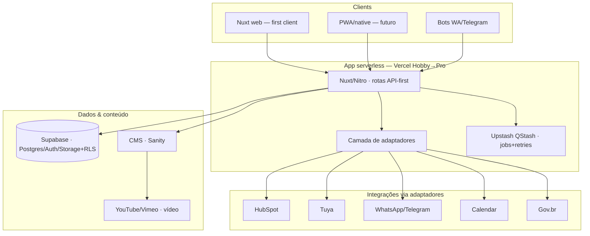

# Architecture & MVP — ForteGB Platform

> **Status:** produto/stack **definidos** (grillings Phase 0 concluídas → D-015..D-022); infra/ambientes/integrações em definição no epic **Arquitetura da solução & ambientes** ([#146](https://github.com/fortegb/platform/issues/146)).  
> **Princípio (D-011, cumprido):** decisões técnicas ficaram abertas até grilling; itens `deferred` reabrem no grilling da fase respectiva.

**Pré-requisito:** GitHub org + bootstrap board.  
**Entrada:** [`open-questions.md`](./open-questions.md) · **Saída:** este doc + [`decisions.md`](./decisions.md) + epics no board  
**Mapa negócio:** [`deliverables.md`](./deliverables.md)

**DEFINE only.** Build = [`phases.md`](./phases.md).

---

## 0. Visão confirmada (produto)

1. **Website** — presença corporativa (UI, marca, valores), portfólio, blog, pontes para redes.
2. **Corretor** — self-service onboarding (registro → termos → Gov.br → staff → portal/bot/clientes).
3. **Cliente** — ver casas; visita autoguiada (agendada + QR); identidade; senha/fechadura; cliente CRM.
4. **Staff ForteGB** — admin (escopo TBD na grilling).
5. **Mobile** — tudo usable no celular (responsive v1; native/PWA TBD).
6. **Backend** — Tuya, HubSpot, WhatsApp, Calendar; CRM multi-canal.
7. **Media kit impresso** por casa.

---

## 1. Scope & MVP boundary

> **Resolvido (2026-07-03, Grilling 0 [#145](https://github.com/fortegb/platform/issues/145)) → D-018.** Fatias verticais; v1 arquitetado em profundidade, v2/v3 just-in-time.

- **v1** — site público + portfólio real + CTA visita **WhatsApp** · **auth + papéis** (fundação) · corretor onboarding (registro → staff aprova) · **registro de cliente + timestamp de comissão (primeiro ganha) + sync HubSpot** · contrato/Gov.br **manual-first** · staff aprovações + clientes · admin config mínimo.
- **v2** — **visitas autoguiadas (agendada + QR)** + identidade + Tuya + calendário + fila de exceção · **Gov.br automatizado** · bots WhatsApp/Telegram de cliente.
- **v3 / Fase 3** — media kit, timeline de obra, motor social, portal cliente logado, BI.

**Corretor antes de tours:** sem dependências de hardware/externas, protege comissão desde cedo, alinhado a venda humana; tours = maior build único → v2.

**Lock now (fundacional, difícil reverter — mesmo com a feature diferida):** modelo de dados core + IDs estáveis (house, user, cliente, corretor; visit/contract como refs forward-looking); RBAC cobrindo todos os papéis; taxonomia de armazenamento (§5); camada de adaptadores; API-first; escolha de queue (QStash).

**Diferido para o grilling da fase:** tours (Q-005/006/017), media kit (Q-009/011–013), social, mobile (Q-008/019), design conversacional dos bots. Estado-alvo → jornadas §8.

---

## 2. User roles & portals

> Preenchido a partir de [`company-structure.md`](./company-structure.md) §6, §7 (2026-07-02). Q-003 parcialmente resolvido.

| Role | Quem | Portal / access | MVP? | Notas |
|------|------|-----------------|------|-------|
| **Visitante** | Público | Site, blog, portfólio | Sim | |
| **Cliente** | Comprador | Fluxo visita, contato | Sim | CPF liga a registro corretor se existir |
| **Corretor** | Contratados (ex. Juliana) | Portal corretor + bot WhatsApp | Sim | CRECI preferencial; mesmo fluxo sem CRECI |
| **Staff** | Cláudia, Gisele (+ sócios em operação) | Área logada operacional | Sim | Despesas, clientes, visitas, consultas |
| **Admin** | Ricardo, Adilson, Felipe | Staff + config, flags, exceções | Sim | Três sócios = admin |
| **Digital** | Ricardo, Felipe | Construção plataforma | Sim | Arquiteto Digital · Desenvolvedor Digital |
| **Sócio / investidor** | Três fundadores | Admin na plataforma | — | Papel público uniforme na apresentação |

**Auth (MVP):** Google, Facebook, e-mail — staff e corretores em `platform`; SSO compartilhado com `app-despesas` (fase posterior).

**MVP (2026-07-03):** **admin** = Ricardo, Adilson, Felipe · **staff** = Cláudia, Gisele (+ sócios).

| Área | Admin only |
|------|------------|
| Hoarding flags | Sim |
| User/role invite | Sim |
| Platform config / API keys | Sim |
| Cliente exceptions, corretor onboarding, void registro | Staff |
| Financials cross-house | Fora do MVP plataforma (TBD pós-sucesso) |

---

## 3. User journey map (MVP)

> **Fonte estado-alvo:** [`jornadas-plataforma.md`](./jornadas-plataforma.md) (atualizado 2026-07-03).  
> **Este §3** = resumo para Architecture; detalhe passo-a-passo permanece em jornadas.  
> **Screen map:** [`screen-map.md`](./screen-map.md) ([#32](https://github.com/fortegb/platform/issues/32)).

| Role | Jornada | Trigger | Steps (resumo) | Outcome |
|------|---------|---------|----------------|---------|
| **Visitante** | Descobrir ForteGB | Google / redes / indicação | Home → portfólio → detalhe casa → blog → contato (WhatsApp / form) | Cliente ou interesse; confiança na marca |
| **Cliente** | Visita agendada | Clica **Agendar visita** no portfólio | Form (nome, WhatsApp, data/hora) → selfie + documento → match ID → (fallback staff) → calendário + Tuya + WhatsApp confirmação → cliente HubSpot → lembrete → expiração senha / follow-up | Visita sem corretor; cliente identificado (LGPD) |
| **Cliente** | Visita instantânea (QR) | QR na placa “À venda” | Micro-página mobile → mesmo fluxo identidade → senha imediata (1–2 h) → WhatsApp/SMS → cliente origem “QR placa” | Entrada na hora; cliente capturado |
| **Corretor** | Onboarding (conta) | Registro no site | OAuth/e-mail → termos gerais → perfil (CRECI opcional) → staff notificado → staff aprova → portal `/corretor` | Conta ativa |
| **Corretor** | Associar casa (1.ª ou extra) | Portal: casas disponíveis | **Reclamar** casa → contrato por imóvel → assinatura (Gov.br — Q-016) → staff aprova | Pode registrar clientes **só nessa casa** |
| **Corretor** | Registrar cliente | Portal ou bot WhatsApp | Nome + CPF + tel + casa → timestamp (**primeiro ganha**) → sync HubSpot → pipeline | Comissão protegida |
| **Corretor** | Pipeline | Portal corretor | Casas com contrato; estados novo → visita → negociação → fechado; notas | Acompanhamento comercial |
| **Staff** | Aprovar corretor / casa | Notificação em cada passo onboarding | Qualquer staff aprova ou rejeita | Corretor ativo ou casa associada |
| **Staff** | Exceção identidade | Match ID falhou (visita) | Fila de exceções → aprovar / rejeitar manualmente | Visita autorizada ou bloqueada |
| **Staff** | Operação diária | Rotina | Visitas do dia (calendário); clientes recentes; cliente manual (WhatsApp telefônico) → HubSpot | Operação sem escritório |
| **Admin** | Config / governo | Área admin | Convites; API keys (Tuya, HubSpot, WhatsApp); flags (ocultar casa, manutenção); relatórios agregados; exceções comissão (com audit) | Plataforma configurada |

**Referências jornadas:** §3.1 site · §3.2 agendada · §3.3 QR · §4 corretor · §5 staff/admin · §6–7 media/social.

### 3.1 Journey gaps

Resolvido em [`screen-map.md`](./screen-map.md) (2026-07-03). Detalhe passo-a-passo staff permanece em jornadas §5.1 (grilling).

---

## 4. System context

> **Confirmado (2026-07-03, Grilling 0) → D-017.** Serverless, API-first. *(Q-007 HubSpot source-of-truth ainda aberto.)* Avaliação serverless vs persistente → [`explore/runtime-serverless-vs-persistent.md`](./explore/runtime-serverless-vs-persistent.md).

---

## 5. Data & content strategy

> **Resolvido Q-004 (2026-07-03) → D-016.** Taxonomia por tipo de conteúdo; join por **ID de casa** compartilhado, merge no Nuxt.

| Domínio | Source of truth | Notas |
|---------|-----------------|-------|
| Conteúdo de casa (fotos, plantas, descrição, timeline) | **CMS** (**Sanity** — D-034/D-036) | autoria com Studio; join por `houseId`; status em Supabase |
| Blog | **CMS** (Sanity) | autoria unificada |
| Estado operacional da casa (status, links a clientes/visitas/verificação) | **Supabase** (Postgres) | queryable; drive de tours/CRM; status ≠ conteúdo |
| Vídeo | **YouTube/Vimeo** (embed) | URL como campo; não passa pelo backend |
| Docs sensíveis (contratos Gov.br, RG/CNH) | **Supabase** bucket privado + RLS | LGPD: encriptação + retenção |
| Cliente / atribuição / CRM | **Supabase** (master) → **HubSpot** (sync) | **Q-007 → D-019**: Supabase é master; HubSpot downstream. Cliente→Contact, Registro→Deal |
| Social | **Fora da plataforma** | drafts IA + scheduler grátis opcional |

---

## 6. Key flows (decisions TBD)

> Ponteiros para jornadas; decisões técnicas fecham na grilling. Detalhe → [`jornadas-plataforma.md`](./jornadas-plataforma.md).

### 6.1 Public site & home *(Q-010 → D-021, diferido)*

- Fluxo visitante: descoberta → portfólio → detalhe → blog → contato ([jornadas §3.1](./jornadas-plataforma.md#31-descobrir-a-fortegb-site-público)).
- **Q-010 diferido (D-021):** variantes diferem **só no hero** (miolo = `HomeContent` compartilhado). Rotas por estilo: `/` (split, default), `/classico`, `/slate`, `/azul`. Escolha do hero fica para o **lançamento**, sob Public site UI (#56); default de produção = `/` (HeroSplit).
- Build: Phase 1 **Public site UI finalization**.

### 6.2 Self-guided visits *(Q-005, Q-006, Q-017)*

- **Agendada:** form → identidade → calendário → Tuya → WhatsApp → CRM ([§3.2](./jornadas-plataforma.md#32-visita-autoguiada--agendada)).
- **Instantânea QR:** placa → micro-página → identidade → senha curta ([§3.3](./jornadas-plataforma.md#33-visita-instantânea--qr-na-placa)).
- **Identidade:** selfie + documento; match frontend; fila staff se falhar (Q-005).
- **Tuya:** senha temporária; expiração pós-janela de visita.
- **Condomínio / portaria:** Q-017 — fluxo extra ou aviso; **não detalhado**.

### 6.3 Cliente & CRM *(Q-007 → D-019, Q-018 → D-020; Q-016)*

- **Fonte-da-verdade:** **Supabase master + HubSpot sync** (D-019). Atribuição/first-wins/auditoria/venda avaliados no Supabase; HubSpot nunca decide comissão.
- **Modelo (D-020):** **1 tabela `cliente`** (`cpf UNIQUE` nullable, `whatsapp NOT NULL`, `email` nullable, `fonte`) — sem CPF = **Contato**, com CPF = **Cliente** (promoção por UPDATE). `cliente` **1─N** `registro` (cliente × casa: status, `corretor_id` null=direto, timestamp) + `historico` append-only. Cliente→Contact, Registro→Deal.
- **Promoção self-service** (visita + CPF); reconciliação CPF-wins / WhatsApp-match / senão novo + merge staff.
- **Linguagem:** "**Cliente**" em todo lugar; feature = "**Registro de Cliente**" (não "Comissões"); rota `/staff/registros`.
- **Escopo:** proteção de comissão + **auditoria visível** no v1; **financeiro/pagamento fora do v1**.
- **Fontes (Q-018):** v1 = portal corretor, staff manual, contatos form-site/CTA-WhatsApp; v2 = QR, bots, tours. `fonte` → propriedade HubSpot. Onboarding + contrato por casa + Gov.br = Q-016 ([§4](./jornadas-plataforma.md#4-jornadas--corretor)).

### 6.4 Media kit & physical *(Q-009, Q-011–Q-013)*

- Por casa: web, placa QR, posters, timeline obra, kit corretor ([§6](./jornadas-plataforma.md#6-jornadas--marketing-e-obra)).
- Phase 3 epics; templates e automação por definir na grilling.

### 6.5 Staff & admin operations

- Staff: aprovações, fila ID, calendário visitas, clientes manuais ([§5.1](./jornadas-plataforma.md#51-staff-operacional)).
- Admin: convites, API keys, flags, relatórios ([§5.2](./jornadas-plataforma.md#52-admin-sócios)).
- **Screen map:** [`screen-map.md`](./screen-map.md); staff/admin shells P1, features P2+.

---

## 7. Non-functional

> **Atualizado (2026-07-03) → D-015, D-017.** Free-first + zero-ops.
> **Arquitetura de infra/ambientes/integrações (full-solution) definida no Epic #146 → D-022** (ambientes, isolamento, integrações 3-tiers, migrações, config/secrets, CI-CD, dev local). **Precede o build.** D-017 (serverless vs persistente) em reavaliação lá.
> **Ambientes (contrato) → D-025 / #147:** exatamente três lógicos — `local` / `staging` / `prod`. Ver [`templates/environments.md`](./templates/environments.md) e página sócios [`ambientes.html`](./ambientes.html).
> **Branches → D-026 / #148:** `main`=`prod` · `staging`=`staging` · `feat/*`/`fix/*` Preview=staging-class. Close→integration (`staging` intent); promote separado. Config opt-in do skill → #166.
> **Vercel → D-027 / #149:** um projeto; Production=`main`; Preview=staging+feat; senha compartilhada nos Previews; env Production vs Preview.
> **Domínios → D-029 / #150.** **Supabase → D-030 / #151** (2 cloud + local Docker; Previews → staging). **Migrações → D-031 / #152** (CLI; não no deploy Vercel). **Runbook local → D-032 / #153** (OrbStack preferido; docs only; init → #171/#43). **Seed/LGPD → D-033 / #154** (pacote sintético; dummy docs; logins teste). **Sanity → D-034/D-035/D-036** (vendor + datasets + content model). **Integrações → D-037..D-039** (posturas + mapa + alvos seguros / slots).

### 7.1 Ambientes (D-025)

| Ambiente | Propósito | Dados | Integrações |
|----------|-----------|-------|-------------|
| **local** | Dev na máquina (Nuxt/Node; isolado por padrão) | Seed / descartável; sem PII real | **Mock** |
| **staging** | Pré-prod privada (dev + UAT sócio opcional) | Seed / anonimizado; sem cópia PII prod por padrão | **Safe-target** |
| **prod** | Sistema ao vivo | PII real (LGPD) | **Prod-live** |

- Identidade: `APP_ENV` ∈ `{local, staging, prod}` (`NODE_ENV` não basta).
- Promoção: staging (ou backends classe-staging) antes de prod; hotfix = exceção explícita/registrada (procedimento → #169).
- Preview/ephemeral = mecanismo de entrega, não quarto nome.

### 7.2 Branches → ambientes (D-026)

| Git | Ambiente |
|-----|----------|
| laptop | `local` |
| `feat/*`, `fix/*` (Preview) | `staging` (backends classe-staging) |
| `staging` | `staging` |
| `main` | `prod` |

- Caminho normal: feat/fix → `staging` → (promote) `main`.
- Lifecycle config opt-in (default merge→`main` se ausente) — implementação do skill → #166.

### 7.3 Vercel (D-027)

| Item | Decisão |
|------|---------|
| Projetos | **Um** |
| Production | branch `main` |
| Preview | `staging` + `feat/*` / `fix/*` |
| Proteção Preview | senha compartilhada (sem conta Vercel para sócios) |
| Env | Production = prod · Preview = staging-class (shared) |

| Topic | Decision |
|-------|----------|
| Hosting | **Vercel Hobby (grátis) → Pro (~$20/mo) quando útil**; Nitro-portável (Netlify/Cloudflare) como seguro |
| Runtime | **Serverless**, API-first; async/retries via **Upstash QStash** |
| Mobile v1 | Responsive web (Q-019); PWA/native depois reutiliza a API |
| Messaging | **Telegram-first** (grátis); WhatsApp = pago-quando-útil |
| LGPD | Docs sensíveis em **bucket privado Supabase + RLS**; encriptação + retenção |
| Auth | Supabase Auth (Google/Facebook/e-mail); RBAC cobrindo todos os papéis |
| Custo | Free-first; bends conhecidos: WhatsApp (por msg), Tuya (quotas) |

---

## 8. Epic list for board (output)

Ver checklist em [`deliverables.md`](./deliverables.md) §8 e [`phases.md`](./phases.md).

---

## 9. Open items

Todas Q-* em [`open-questions.md`](./open-questions.md) **resolved** ou **deferred** antes de fechar epic.
