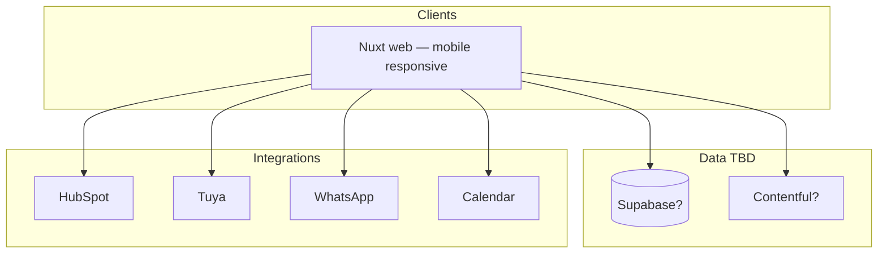

# Architecture & MVP — ForteGB Platform

> **Status:** rascunho — preenchido no epic **Architecture & MVP definition** (Phase 0).  
> **Princípio (D-011):** decisões técnicas **abertas** até grilling — escolher a melhor solução no momento, não na preparação.

**Pré-requisito:** GitHub org + bootstrap board.  
**Entrada:** [`open-questions.md`](./open-questions.md) · **Saída:** este doc + [`decisions.md`](./decisions.md) + epics no board  
**Mapa negócio:** [`deliverables.md`](./deliverables.md)

**DEFINE only.** Build = [`phases.md`](./phases.md).

---

## 0. Visão confirmada (produto)

1. **Website** — presença corporativa (UI, marca, valores), portfólio, blog, pontes para redes.
2. **Corretor** — self-service onboarding (registo → termos → Gov.br → staff → portal/bot/leads).
3. **Cliente** — ver casas; visita autoguiada (agendada + QR); identidade; senha/fechadura; lead CRM.
4. **Staff ForteGB** — admin (escopo TBD na grilling).
5. **Mobile** — tudo usable no telemóvel (responsive v1; native/PWA TBD).
6. **Backend** — Tuya, HubSpot, WhatsApp, Calendar; CRM multi-canal.
7. **Media kit impresso** por casa.

---

## 1. Scope & MVP boundary

*(Q-003, Q-006, Q-018 — TBD)*

- **MVP v1:** …
- **Fora do MVP v1:** …

---

## 2. User roles & portals

> Preenchido a partir de [`company-structure.md`](./company-structure.md) §6, §7 (2026-07-02). Q-003 parcialmente resolvido.

| Role | Quem | Portal / access | MVP? | Notas |
|------|------|-----------------|------|-------|
| **Visitante** | Público | Site, blog, portfólio | Sim | |
| **Cliente** | Comprador | Fluxo visita, contacto | Sim | CPF liga a registo corretor se existir |
| **Corretor** | Contratados (ex. Juliana) | Portal corretor + bot WhatsApp | Sim | CRECI preferencial; mesmo fluxo sem CRECI |
| **Staff** | Cláudia, Gisele (+ sócios em operação) | Área logada operacional | Sim | Despesas, leads, visitas, consultas |
| **Admin** | Ricardo, Adilson, Felipe | Staff + config, flags, excepções | Sim | Três sócios = admin |
| **Digital** | Ricardo, Felipe | Construção plataforma | Sim | Arquiteto Digital · Desenvolvedor Digital |
| **Sócio / investidor** | Três fundadores | Admin na plataforma | — | Papel público uniforme na apresentação |

**Auth (MVP):** Google, Facebook, e-mail — staff e corretores em `platform`; SSO partilhado com `app-despesas` (fase posterior).

**MVP (2026-07-03):** **admin** = Ricardo, Adilson, Felipe · **staff** = Cláudia, Gisele (+ sócios).

| Área | Admin only |
|------|------------|
| Hoarding flags | Sim |
| User/role invite | Sim |
| Platform config / API keys | Sim |
| Lead exceptions, corretor onboarding, void registo | Staff |
| Financials cross-house | Fora do MVP plataforma (TBD pós-sucesso) |

---

## 3. User journey map (MVP)

| Role | Trigger | Steps | Outcome |
|------|---------|-------|---------|
| Cliente — visita agendada | | | |
| Cliente — QR instantâneo | | | |
| Corretor — onboarding (conta) | Auto-registo → termos site | Staff notificado cada passo |
| Corretor — por casa | Ver ofertas → **reclamar casa** → Gov.br → staff aprova | 1.ª casa no onboarding **ou** casas extra se já activo |
| Corretor — outra casa | Portal: outras ofertas → reclamar → novo contrato | Mesmo fluxo; perfil reutilizado |
| Corretor — prospecto | Bot/portal nome+CPF | Só casas com contrato aprovado |
| Staff — corretor | Notificações todos passos; **qualquer staff** aprova | |

---

## 4. System context

*(Stack **proposta** — confirmar Q-004, Q-007)*

---

## 5. Data & content strategy

*(Q-004)*

| Domain | Source of truth | Notes |
|--------|-----------------|-------|
| Houses | TBD | |
| Blog | TBD | |
| Media kit / timeline | TBD | |
| Leads / CRM | TBD | Q-007, Q-018 |

---

## 6. Key flows (decisions TBD)

### 6.1 Public site & home *(Q-010)*

### 6.2 Self-guided visits *(Q-005, Q-006, Q-017)*

- Scheduled …
- Instant QR …
- Identity …
- Tuya lock …
- **Condomínio / gate** … *(Q-017)*

### 6.3 Corretor & CRM *(Q-007, Q-016, Q-018)*

- Termos/contrato …
- Lead sources matrix …

### 6.4 Media kit & physical *(Q-009, Q-011–Q-013)*

---

## 7. Non-functional

| Topic | Decision |
|-------|----------|
| Hosting | Vercel (proposed) |
| Mobile v1 | Responsive web (proposed — Q-019) |
| LGPD | TBD |
| Auth | Supabase Auth (proposed) |

---

## 8. Epic list for board (output)

Ver checklist em [`deliverables.md`](./deliverables.md) §8 e [`phases.md`](./phases.md).

---

## 9. Open items

Todas Q-* em [`open-questions.md`](./open-questions.md) **resolved** ou **deferred** antes de fechar epic.
