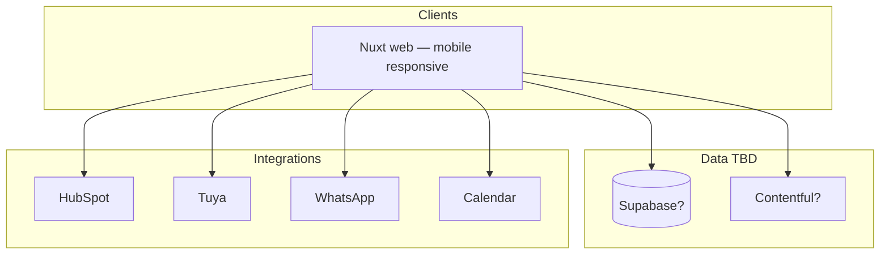

# Architecture & MVP — ForteGB Platform

> **Status:** rascunho — preenchido no epic **Architecture & MVP definition** (Phase 0).  
> **Princípio (D-011):** decisões técnicas **abertas** até grilling — escolher a melhor solução no momento, não na preparação.

**Pré-requisito:** GitHub org + bootstrap board.  
**Entrada:** [`open-questions.md`](./open-questions.md) · **Saída:** este doc + [`decisions.md`](./decisions.md) + epics no board  
**Mapa negócio:** [`deliverables.md`](./deliverables.md)

**DEFINE only.** Build = [`phases.md`](./phases.md).

---

## 0. Visão confirmada (produto)

1. **Website** — presença corporativa (UI, marca, valores), portfólio, blog, pontes para redes.
2. **Corretor** — self-service onboarding (registo → termos → Gov.br → staff → portal/bot/leads).
3. **Cliente** — ver casas; visita autoguiada (agendada + QR); identidade; senha/fechadura; lead CRM.
4. **Staff ForteGB** — admin (escopo TBD na grilling).
5. **Mobile** — tudo usable no telemóvel (responsive v1; native/PWA TBD).
6. **Backend** — Tuya, HubSpot, WhatsApp, Calendar; CRM multi-canal.
7. **Media kit impresso** por casa.

---

## 1. Scope & MVP boundary

*(Q-003, Q-006, Q-018 — TBD; resumo estado-alvo em [`jornadas-plataforma.md`](./jornadas-plataforma.md) §8.)*

- **MVP v1 (proposta):** site público + portfólio real; login corretor/staff/admin; visita agendada + QR; identidade + fallback manual; HubSpot leads principais; portal corretor; placa QR básica; WhatsApp confirmações.
- **Fora do MVP v1 (proposta):** app nativo; automação social completa; condomínio automatizado; match facial avançado; portal cliente logado; BI avançado; PDF media kit totalmente automático.

**Fronteira exacta:** fechar no epic Architecture (Q-003, Q-006, Q-018). Ver tabela completa → jornadas §8.

---

## 2. User roles & portals

> Preenchido a partir de [`company-structure.md`](./company-structure.md) §6, §7 (2026-07-02). Q-003 parcialmente resolvido.

| Role | Quem | Portal / access | MVP? | Notas |
|------|------|-----------------|------|-------|
| **Visitante** | Público | Site, blog, portfólio | Sim | |
| **Cliente** | Comprador | Fluxo visita, contacto | Sim | CPF liga a registo corretor se existir |
| **Corretor** | Contratados (ex. Juliana) | Portal corretor + bot WhatsApp | Sim | CRECI preferencial; mesmo fluxo sem CRECI |
| **Staff** | Cláudia, Gisele (+ sócios em operação) | Área logada operacional | Sim | Despesas, leads, visitas, consultas |
| **Admin** | Ricardo, Adilson, Felipe | Staff + config, flags, excepções | Sim | Três sócios = admin |
| **Digital** | Ricardo, Felipe | Construção plataforma | Sim | Arquiteto Digital · Desenvolvedor Digital |
| **Sócio / investidor** | Três fundadores | Admin na plataforma | — | Papel público uniforme na apresentação |

**Auth (MVP):** Google, Facebook, e-mail — staff e corretores em `platform`; SSO partilhado com `app-despesas` (fase posterior).

**MVP (2026-07-03):** **admin** = Ricardo, Adilson, Felipe · **staff** = Cláudia, Gisele (+ sócios).

| Área | Admin only |
|------|------------|
| Hoarding flags | Sim |
| User/role invite | Sim |
| Platform config / API keys | Sim |
| Lead exceptions, corretor onboarding, void registo | Staff |
| Financials cross-house | Fora do MVP plataforma (TBD pós-sucesso) |

---

## 3. User journey map (MVP)

> **Fonte estado-alvo:** [`jornadas-plataforma.md`](./jornadas-plataforma.md) (actualizado 2026-07-03).  
> **Este §3** = resumo para Architecture; detalhe passo-a-passo permanece em jornadas.  
> **Screen map:** pendente Topic C ([#32](https://github.com/fortegb/platform/issues/32)).

| Role | Jornada | Trigger | Steps (resumo) | Outcome |
|------|---------|---------|----------------|---------|
| **Visitante** | Descobrir ForteGB | Google / redes / indicação | Home → portfólio → detalhe casa → blog → contato (WhatsApp / form) | Lead ou interesse; confiança na marca |
| **Cliente** | Visita agendada | Clica **Agendar visita** no portfólio | Form (nome, WhatsApp, data/hora) → selfie + documento → match ID → (fallback staff) → calendário + Tuya + WhatsApp confirmação → lead HubSpot → lembrete → expiração senha / follow-up | Visita sem corretor; lead identificado (LGPD) |
| **Cliente** | Visita instantânea (QR) | QR na placa “À venda” | Micro-página mobile → mesmo fluxo identidade → senha imediata (1–2 h) → WhatsApp/SMS → lead origem “QR placa” | Entrada na hora; lead capturado |
| **Corretor** | Onboarding (conta) | Registo no site | OAuth/e-mail → termos gerais → perfil (CRECI opcional) → staff notificado → staff aprova → portal `/corretor` | Conta activa |
| **Corretor** | Associar casa (1.ª ou extra) | Portal: casas disponíveis | **Reclamar** casa → contrato por imóvel → assinatura (Gov.br — Q-016) → staff aprova | Pode registar prospectos **só nessa casa** |
| **Corretor** | Registar prospecto | Portal ou bot WhatsApp | Nome + CPF + tel + casa → timestamp (**primeiro ganha**) → sync HubSpot → pipeline | Comissão protegida |
| **Corretor** | Pipeline | Portal corretor | Casas com contrato; estados novo → visita → negociação → fechado; notas | Acompanhamento comercial |
| **Staff** | Aprovar corretor / casa | Notificação em cada passo onboarding | Qualquer staff aprova ou rejeita | Corretor activo ou casa associada |
| **Staff** | Excepção identidade | Match ID falhou (visita) | Fila de excepções → aprovar / rejeitar manualmente | Visita autorizada ou bloqueada |
| **Staff** | Operação diária | Rotina | Visitas do dia (calendário); leads recentes; lead manual (WhatsApp telefónico) → HubSpot | Operação sem escritório |
| **Admin** | Config / governo | Área admin | Convites; API keys (Tuya, HubSpot, WhatsApp); flags (ocultar casa, manutenção); relatórios agregados; excepções comissão (com audit) | Plataforma configurada |

**Referências jornadas:** §3.1 site · §3.2 agendada · §3.3 QR · §4 corretor · §5 staff/admin · §6–7 media/social.

### 3.1 Journey gaps (light skim — Topic C)

Itens **notados** em 2026-07-03; revisão completa fica para Topic C (completeness + screen map):

| Gap | Notas |
|-----|--------|
| Staff journeys | Tarefas listadas (§5.1); falta fluxo passo-a-passo como cliente/corretor |
| Admin vs staff UI | Limites em §2; jornadas §5 mistura tarefas — separar screens admin-only |
| Condomínio / portaria | Q-017 referenciado na visita QR/agendada; sem passos nem copy de aviso |
| Aprovação manual ID | Um passo em visita agendada; fila staff não detalhada |
| Pós-visita follow-up | Mencionado; TBD MVP vs pós-MVP ([`deliverables.md`](./deliverables.md) §3) |
| Bot WhatsApp corretor | Mencionado §4.3; sem passos |
| Portal cliente logado | Explicitamente “depois” (jornadas §8) — OK se MVP fechado assim |
| Integrações | Módulo em jornadas §7; sem jornada utilizador (backend) |

---

## 4. System context

*(Stack **proposta** — confirmar Q-004, Q-007)*

---

## 5. Data & content strategy

*(Q-004)*

| Domain | Source of truth | Notes |
|--------|-----------------|-------|
| Houses | TBD | |
| Blog | TBD | |
| Media kit / timeline | TBD | |
| Leads / CRM | TBD | Q-007, Q-018 |

---

## 6. Key flows (decisions TBD)

> Ponteiros para jornadas; decisões técnicas fecham na grilling. Detalhe → [`jornadas-plataforma.md`](./jornadas-plataforma.md).

### 6.1 Public site & home *(Q-010)*

- Fluxo visitante: descoberta → portfólio → detalhe → blog → contato ([jornadas §3.1](./jornadas-plataforma.md#31-descobrir-a-fortegb-site-público)).
- **Decisão pendente:** 2 homes vencedores (com/sem hero); variantes `/`–`/v4` em mock.
- Build: Phase 1 **Public site UI finalization**.

### 6.2 Self-guided visits *(Q-005, Q-006, Q-017)*

- **Agendada:** form → identidade → calendário → Tuya → WhatsApp → CRM ([§3.2](./jornadas-plataforma.md#32-visita-autoguiada--agendada)).
- **Instantânea QR:** placa → micro-página → identidade → senha curta ([§3.3](./jornadas-plataforma.md#33-visita-instantânea--qr-na-placa)).
- **Identidade:** selfie + documento; match frontend; fila staff se falhar (Q-005).
- **Tuya:** senha temporária; expiração pós-janela de visita.
- **Condomínio / portaria:** Q-017 — fluxo extra ou aviso; **não detalhado**.

### 6.3 Corretor & CRM *(Q-007, Q-016, Q-018)*

- Onboarding + contrato **por casa** + Gov.br (Q-016) ([§4](./jornadas-plataforma.md#4-jornadas--corretor)).
- Prospectos: primeiro registo ganha; sync HubSpot; bot WhatsApp TBD.
- **Lead sources matrix:** form site, visitas, corretor, WhatsApp (Q-018) — [`deliverables.md`](./deliverables.md) §4.

### 6.4 Media kit & physical *(Q-009, Q-011–Q-013)*

- Por casa: web, placa QR, posters, timeline obra, kit corretor ([§6](./jornadas-plataforma.md#6-jornadas--marketing-e-obra)).
- Phase 3 epics; templates e automação por definir na grilling.

### 6.5 Staff & admin operations

- Staff: aprovações, fila ID, calendário visitas, leads manuais ([§5.1](./jornadas-plataforma.md#51-staff-operacional)).
- Admin: convites, API keys, flags, relatórios ([§5.2](./jornadas-plataforma.md#52-admin-sócios)).
- **Gap:** screen map inexistente; MVP mínimo staff a definir em Topic C.

---

## 7. Non-functional

| Topic | Decision |
|-------|----------|
| Hosting | Vercel (proposed) |
| Mobile v1 | Responsive web (proposed — Q-019) |
| LGPD | TBD |
| Auth | Supabase Auth (proposed) |

---

## 8. Epic list for board (output)

Ver checklist em [`deliverables.md`](./deliverables.md) §8 e [`phases.md`](./phases.md).

---

## 9. Open items

Todas Q-* em [`open-questions.md`](./open-questions.md) **resolved** ou **deferred** antes de fechar epic.
