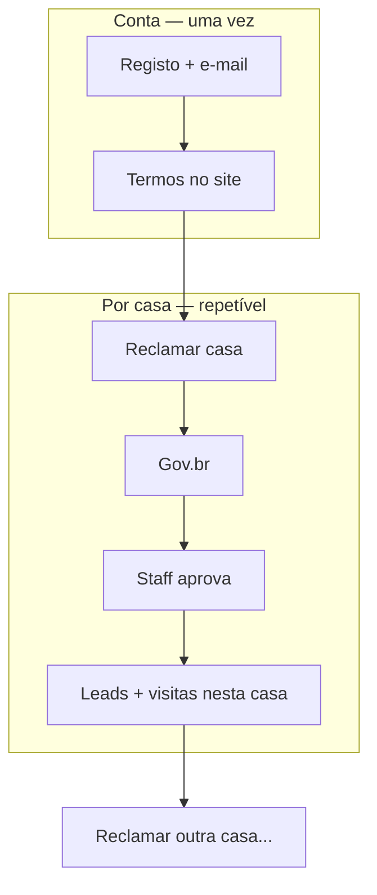

# Contrato de parceria — Corretor × ForteGB

> **Status:** rascunho genérico (2026-07-02) — **não é aconselhamento jurídico**.  
> Baseado em [`company-structure.md`](./company-structure.md) §6.  
> **Revisão final:** Juliana Mestrinier + sócios ForteGB + advogado se necessário.

---

## Partes

**CONTRATANTE(S)** — PF(s) proprietária(s) **deste imóvel** (contrato **por casa**):  
- Nome: `[NOME_PROPRIETARIO_1]` · CPF: `[CPF_1]`  
- Nome: `[NOME_PROPRIETARIO_2]` · CPF: `[CPF_2]` *(se aplicável)*  

*(Um corretor pode ter **vários contratos** — um por casa reclamada; dados do corretor reutilizados, documento novo por imóvel.)*

**CONTRATADA(O)** — Corretor(a) de imóveis:  
- Nome: `[NOME_CORRETOR]` · CPF/CNPJ: `[DOCUMENTO_CORRETOR]`  
- CRECI: `[CRECI]` *(preferencial; mesmo fluxo se em branco — ver cláusula 2)*  
- E-mail: `[EMAIL]` · Telefone / WhatsApp: `[TELEFONE]`

**IMÓVEL OBJECTO:** `[IDENTIFICACAO_CASA]` — ex. Casa 04, endereço `[ENDERECO]`, matrícula `[MATRICULA]`.

---

## Cláusula 1 — Objecto e preço unificado

1.1. O(A) CONTRATADO(A) actua na **intermediação de venda** do imóvel identificado acima, em parceria com a(s) CONTRATANTE(S), marca **ForteGB**.

1.2. O **preço de venda público** é **único**: `[PRECO_VENDA]` (R$ `[VALOR]`). O mesmo preço aplica-se quer o comprador chegue via corretor quer via contacto directo com a(s) CONTRATANTE(S) ou plataforma ForteGB.

1.3. A(s) CONTRATANTE(S) podem divulgar o imóvel livremente (site, redes, placas, QR, visitas autoguiadas) sem reduzir o preço nem anular comissão nos termos deste contrato.

---

## Cláusula 2 — CRECI e adesão à plataforma

2.1. **CRECI activo é preferencial** mas **não obrigatório** para adesão ao esquema ForteGB. Corretores com ou sem CRECI seguem o **mesmo fluxo** de registo de leads e regras de comissão.

2.2. O(A) CONTRATADO(A) adere ao **portal / bot WhatsApp** ForteGB para registo formal de prospectos, conforme cláusula 4.

---

## Cláusula 3 — Comissão

3.1. **Percentagem:** `[PERCENTAGEM]`% sobre o valor efectivo de venda — ex. referência mercado ~5%; ForteGB prática recente 3%.

3.2. **Pagamento em duas etapas** (salvo acordo escrito diferente neste contrato):

| Etapa | Momento | Valor |
|-------|---------|-------|
| 1 | Assinatura do **contrato de promessa / sinal** com comprador registado | `[PERCENTUAL_SINAL]`% da comissão total |
| 2 | **Escritura** definitiva | Restante da comissão |

3.3. Comissão devida **somente** se o **comprador** for prospecto **validamente registado** pelo(a) CONTRATADO(A) para este imóvel (cláusula 4).

3.4. **Sem registo prévio válido** → sem comissão, salvo excepção aprovada por escrito pela(s) CONTRATANTE(S).

3.5. Vendas **directas** (prospecto nunca registado pelo corretor e captado primeiro pela plataforma/contacto directo ForteGB) → **sem comissão**.

---

## Cláusula 4 — Registo de prospectos

4.1. O(A) CONTRATADO(A) deve **registar cada prospecto antes** que o prospecto seja capturado pela plataforma ForteGB (formulário, WhatsApp, visita agendada, visita instantânea QR, etc.).

4.2. **Registo:** envio de **nome completo + CPF** do prospecto via **bot WhatsApp** ForteGB ou portal. Registo válido gera **confirmação imediata** e, quando disponível, **PDF de termo de registo**.

4.3. **Âmbito:** registo válido **por imóvel / contrato por casa**. O mesmo prospecto pode ser directo noutro imóvel ForteGB.

4.4. **Validade:** atribuição mantém-se **até a venda do imóvel**, sem expiração por tempo.

4.5. **Duplicidade:** primeiro registo válido (nome + CPF) prevalece; a plataforma alerta tentativas duplicadas.

4.6. **CPF** sujeito a validação automática. Registos em volume anormal podem ser sinalizados e revogados por fraude ou abuso.

4.7. ForteGB **não contacta** o prospecto apenas para validar registo do corretor.

---

## Cláusula 5 — Visitas e marketing

5.1. Prospectos registados podem usar **visitas autoguiadas** (agendadas ou instantâneas). A plataforma pode exibir *«Seu Corretor: [nome]»* ao prospecto.

5.2. O(A) CONTRATADO(A) recebe **link para agendar visita** após registo confirmado.

---

## Cláusula 6 — Transparência na venda

6.1. Quando o imóvel for vendido, ForteGB notificará corretores com registos activos neste imóvel (WhatsApp), com **identificação do comprador** (nome + CPF) para transparência.

6.2. Comissão paga conforme cláusula 3 se o comprador for prospecto registado do(a) CONTRATADO(A).

---

## Cláusula 7 — Corretores sem contrato formal

7.1. Corretores que **não** assinarem este modelo podem continuar a actuar informalmente; **não** há garantia automática de comissão nem registo em portal.

---

## Cláusula 8 — Obrigações do corretor

8.1. Actuar com boa-fé; não registar prospectos fictícios.

8.2. Violação grave (fraude, hoarding) → rescisão e perda de comissões pendentes, salvo disposição legal em contrário.

---

## Cláusula 9 — LGPD

9.1. Dados de prospectos tratados apenas para venda do imóvel e cumprimento deste contrato, conforme política de privacidade ForteGB.

---

## Cláusula 10 — Prazo e rescisão

10.1. Vigência: da assinatura até **venda do imóvel** ou rescisão por escrito.

10.2. Registos válidos anteriores à rescisão mantêm-se até venda do imóvel, salvo acordo diferente.

---

## Cláusula 11 — Foro

11.1. Foro da comarca de **Campinas-SP**.

---

## Assinaturas

| | Nome | CPF | Data |
|---|------|-----|------|
| Contratante 1 | | | |
| Contratante 2 | | | |
| Corretor(a) | | | |

---

## Anexo A — Dados deste imóvel (preencher por casa)

| Campo | Valor |
|-------|-------|
| Identificação casa | |
| Preço unificado | |
| Comissão % | |
| % comissão no sinal | |
| % comissão na escritura | |
| Data início oferta | |

---

*Versão 0.1 — gerada a partir das regras acordadas em `company-structure.md`. Revisar com Juliana Mestrinier antes de uso.*

**Assinatura (MVP):** **Gov.br**. E-sign comercial = avaliação futura.

**Revisão:** Ricardo apresenta à Juliana Mestrinier → redlines → aprovação trio → piloto com Juliana.

**Onboarding (portal):** registo conta → termos → **por casa:** reclamar → Gov.br → staff → leads.

